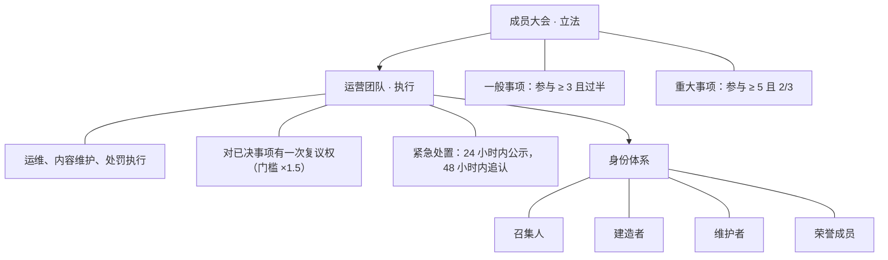
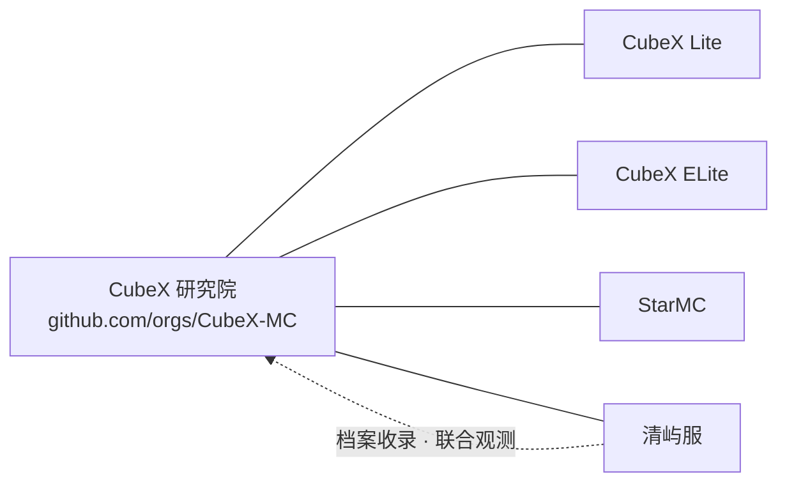

<!--
  清屿服务器 · 组织主页
  GitHub 组织主页实际读取本文件（profile/README.md）；
  仓库根目录 README.md 与本文件内容保持一致。
  描述来源：官网 www.aqcraft.cn、CubeX 研究院服务器档案 cubexmc.org/servers/
-->

  

---

## 关于清屿

清屿是一台面向 **生电（技术向生存）** 的 Minecraft 服务器。核心玩法集中在红石机械、自动化装置与大型工程的设计、验证与落地，同时也欢迎常规生存、建筑与休闲玩家长期定居。

服务器同时开放 **Java 版**与**基岩版**入口，两个版本共用同一套世界；主服之外另设一台与主服**使用同一种子**的测试服，方便在正式施工前验证机器与红石设计。主服与测试服均提供网页地图。

> [!IMPORTANT]
> 主服同时开放 Java 版与基岩版入口，同名账号在两侧的数据互通（Same-ID）。
> 测试服的互通策略仍在调整，请以群内公告为准，不要以主服的经验直接套用。

## 服务器

| 入口 | 地址 | 支持版本 | 网页地图 |
| --- | --- | --- | --- |
| 主服 · Java | `mc.aqcraft.cn` | 1.20 – 26.3 | [主服地图](http://202.189.10.108:20851/) |
| 主服 · 基岩 | `202.189.10.108:20577` | 26.0 – 26.5 | [主服地图](http://202.189.10.108:20851/) |
| 测试服 · Java | `test.aqcraft.cn` | 1.20 – 26.3 | [测试服地图](http://202.189.10.109:30198/) |
| 测试服 · 基岩 | `202.189.10.109:30187` | 26.0 – 26.5 | [测试服地图](http://202.189.10.109:30198/) |

> [!NOTE]
> 状态数据由 mcsrvstat.us 在页面载入时实时查询，CubeX 研究院另有每 30 分钟一次的采样记录。
> 上方徽章为动态查询结果；版本区间来自服务端与档案标注，实际可进入版本以服务端为准。

> [!TIP]
> 测试服与主服同种子、独立世界，适合在正式建造前跑机器、试红石、验证坐标与选区。
> 需要长期保留的成果请回主服施工，不要让测试服承担存档职责。

## 治理与身份

清屿的治理遵循「谁玩得多，谁说了算」：立法权归**成员大会**（近 30 天内登录过至少一次的活跃玩家，在 QQ 群投票，无需在线），**运营团队**只负责执行与服务，不自行立法。

身份只回答「你在清屿做什么」，不分等级；长期离开后回归属于状态变化，不是独立身份。完整条款见 [QingYu-docs](https://github.com/MCQingYu-Team/QingYu-docs) 中的《玩家身份与治理条例》与《七日阳光流程》。

## 与 CubeX 的合作关系

  &nbsp;&nbsp;
    
  清屿服务器 × CubeX-MC（方块叉 / CubeX 研究院） 
  两侧标识仅用于标识合作关系，版权分别归清屿服务器与 CubeX 研究院所有

清屿与 [CubeX-MC（方块叉 / CubeX 研究院）](https://github.com/orgs/CubeX-MC/) 是**合作组织**关系，而非从属或合并。CubeX 起自 WolfX Commune 社区，2021 年 11 月开服；2026 年由研究院接管 GitHub 组织与 `cubexmc.org`，并提出「泛 CubeX」概念——以品牌为核心，把为社区做出过贡献的人与仍在运转的服务器都算进来。清屿服即这一网络中被收录并有持续观测记录的一台服务器。

双方的合作范围：

| 合作项 | 内容 |
| --- | --- |
| 档案收录 | 清屿服收录于 CubeX 研究院「服务器档案」SRV 第 04 条，含入口地址、版本区间与玩法标签 |
| 联合观测 | 在线状态与人数由研究院每 30 分钟自动采样，可查历史曲线与峰值；清屿侧亦使用其服务器查询工具 |
| 社区往来 | 两边玩家与技术交流保持互通，公共设施与工具链相互参考 |
| 记录留存 | 为多服务器网络留存可回溯的运营记录，避免服务器更迭导致历史断档 |

> [!WARNING]
> 合作不等于合并。清屿保持独立运营、独立规则体系与独立的封禁记录；两侧的身份、权限、账号与存档**均不互认**。
> CubeX 研究院档案中的内容属于第三方独立观测记录，不构成清屿的官方公告。

> [!CAUTION]
> 进入任何一台服务器前，请阅读该服自身的规则。清屿的处罚依据《玩家守则》与处罚细目表执行，不受其他服务器的裁决约束，也不为其他服务器的行为背书；
> 清屿不公开世界存档，任何以「清屿存档」名义发布的文件均非官方。

## 加入我们

> [!TIP]
> 点击链接加入群聊【不知道什么是阿清的群的群】：<https://qm.qq.com/q/UtMBMfsr8m>

- **进服**：按上表添加服务器地址，先阅读《玩家守则》，再开始探索。
- **反馈**：规则与文档问题可在 [QingYu-docs](https://github.com/MCQingYu-Team/QingYu-docs) 提交 Issue 或 Pull Request。
- **申诉**：处罚申诉与解封走封禁系统与群内流程，不通过 Issue 处理。

## 链接

| 类别 | 地址 |
| --- | --- |
| 官网 | <https://www.aqcraft.cn/> |
| 规则与条例 | <https://github.com/MCQingYu-Team/QingYu-docs> |
| 封禁系统 | <https://ban.aqcraft.cn/> |
| QQ 群 | <https://qm.qq.com/q/UtMBMfsr8m> |
| 主服网页地图 | <http://202.189.10.108:20851/> |
| 测试服网页地图 | <http://202.189.10.109:30198/> |
| 合作组织 | <https://github.com/orgs/CubeX-MC/> |
| 服务器档案 | <https://cubexmc.org/servers/> |
| 服务器查询 | <https://cubexmc.org/lookup> |

清屿服务器 · 生电 | 红石科技 | 技术向生存 
描述综合自官网 aqcraft.cn 与 CubeX 研究院服务器档案；状态数据来自 mcsrvstat.us 实时查询与研究院采样 
最后更新：2026-09-25

